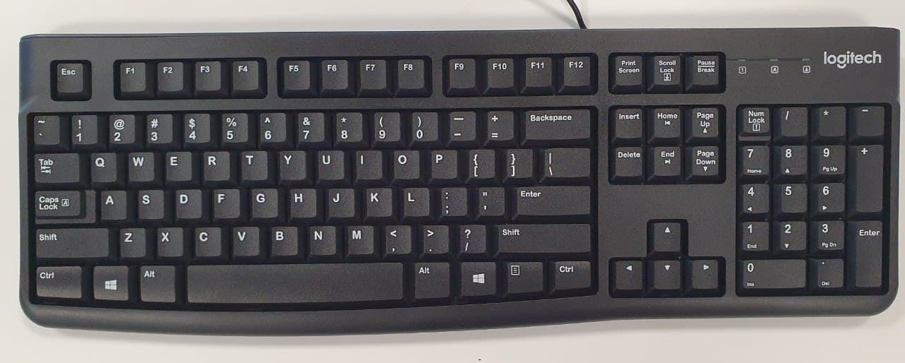

# B.K.B (good name)

[DigiKeyboard reference](https://github.com/digistump/DigistumpArduino/blob/master/digistump-avr/libraries/DigisparkKeyboard/DigiKeyboard.h)
|
[DigiMouse reference](https://github.com/digistump/DigistumpArduino/blob/master/digistump-avr/libraries/DigisparkMouse/DigiMouse.h) 
(only one can be used at a time)

## Parts used
1. Standard usb keyboard   

2. Usb hub with FE1.1s chip  

3. DigiSpark with Arduino ATtiny85 microprocessor  

We want to use Digispark to delivery the payload while still keeping the keyboard functional, so a usb hub is needed.
The internal keyboard PCB is connected to the usb hub, and digispark is also connected to up. The upstream port of the usb hub is what will be conneted to the computer.

<insert completed internal wiring with label here>

## Digispark bootloader

By default, the Digispark have a 5 second programming delay once plugged in for uploading new code. This has caused issues for Windows to fail to recognise Digispark as a USB device when it is conected to the hub with another keyboard, a new bootloader is needed to remove the delay, removing the delay also allows the attack to be carred out faster.

The bootloader can be found [here](https://github.com/micronucleus/micronucleus/tree/v1.11/upgrade/releases) under the name `micronucleus-1.11-entry-jumper-pb0-upgrade.hex`, the program to fash the bootloader can be found [here](https://github.com/digistump/DigistumpArduino/releases/download/1.6.5a/micronucleus-2.0a4-win.zip).

To flash the firmware, unzip the micronucleus folder, in a command prompt, ender the full path of micronucleus.exe, followed by the full path of the bootloader hex file, then plug in Digispark to the the computer.

Ater the bootloader is flashed, the delay should be removed. To program digispark after flashing to the new bootloader, bridge the GND and P0 pins on Digispark with a conductive wire when uploading new code.

## Hiding Digispark's name
libraries\DigisparkKeyboard\usbconfig.h
