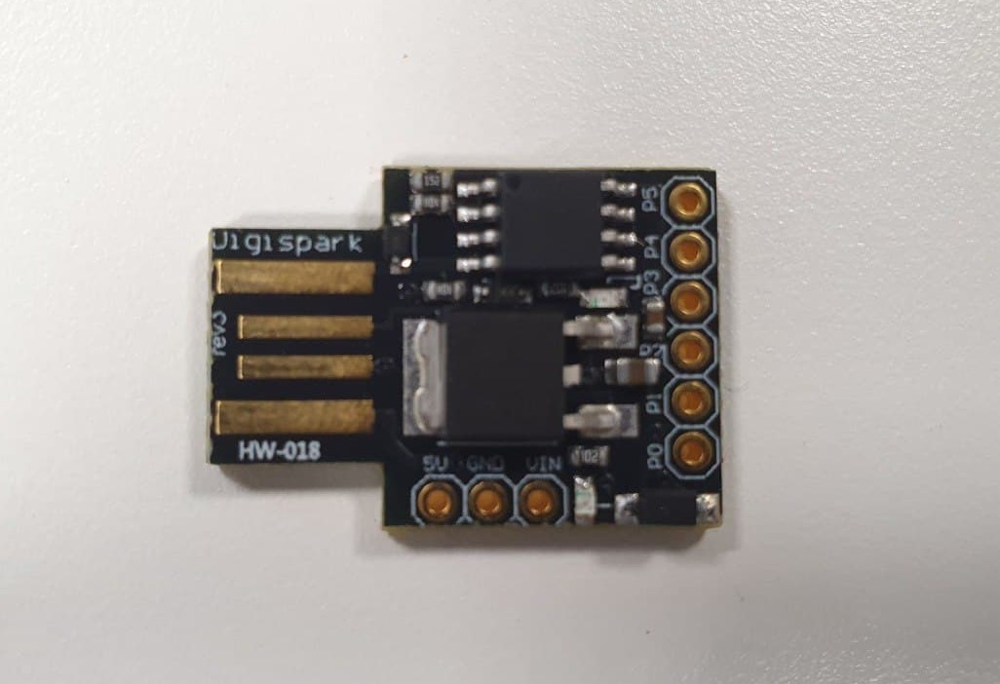

# B.K.B (good name)

[DigiKeyboard reference](https://github.com/digistump/DigistumpArduino/blob/master/digistump-avr/libraries/DigisparkKeyboard/DigiKeyboard.h)
|
[DigiMouse reference](https://github.com/digistump/DigistumpArduino/blob/master/digistump-avr/libraries/DigisparkMouse/DigiMouse.h) 
(only one can be used at a time)

# Parts used
1. Standard usb keyboard   

2. Usb hub with FE1.1s chip  

3. DigiSpark with Arduino ATtiny85 microprocessor  

We want to use digispark to delivery the payload while still keeping the keyboard functional, so a usb hub is needed.
The internal keyboard PCB is connected to the usb hub, and digispark is also connected to up. The upstream port of the usb hub is what will be conneted to the computer.
